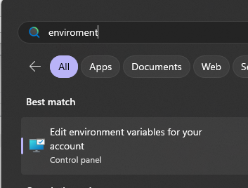
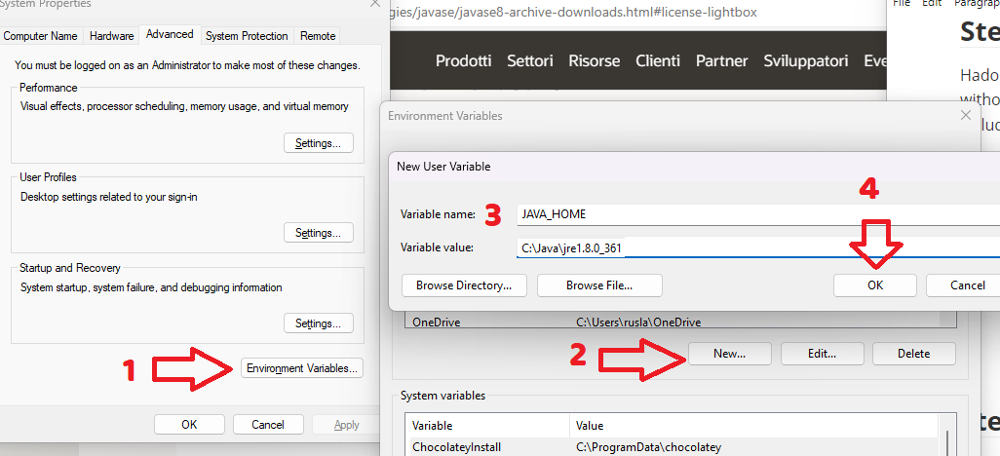
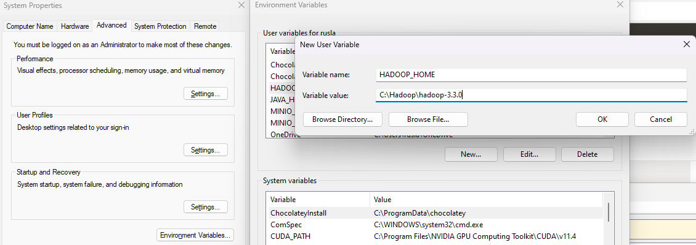
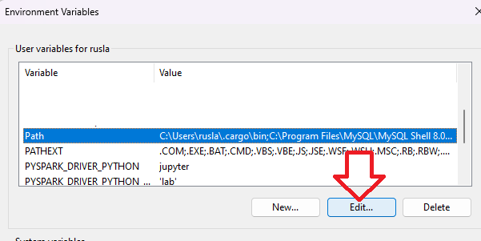
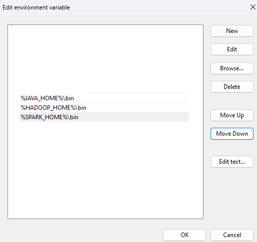
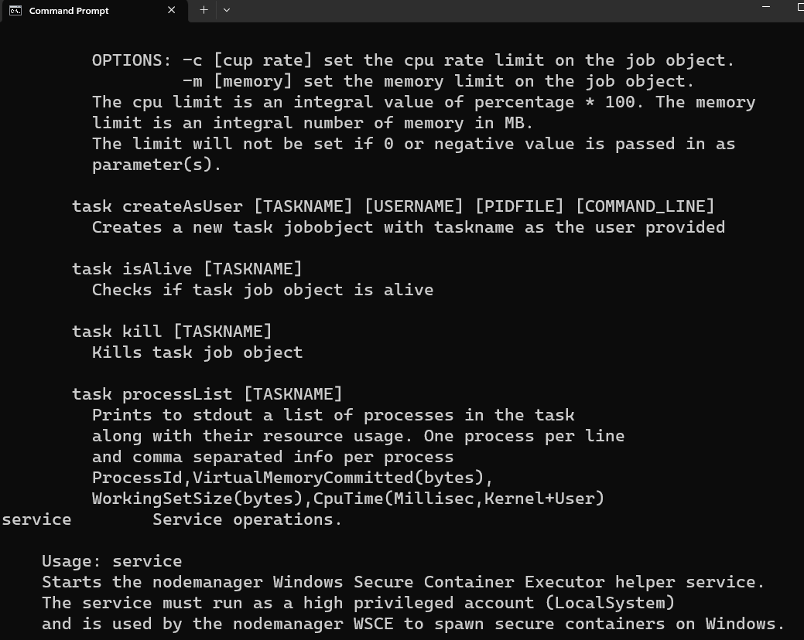
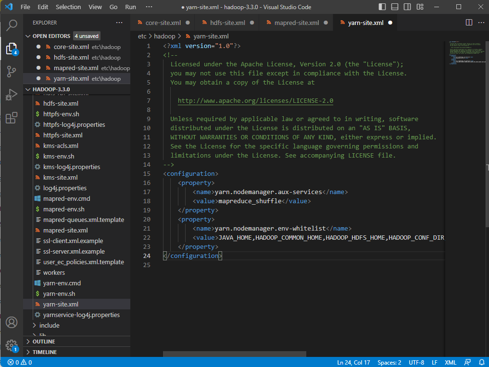
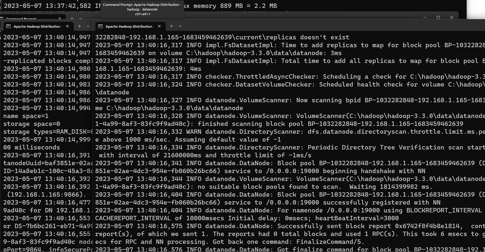
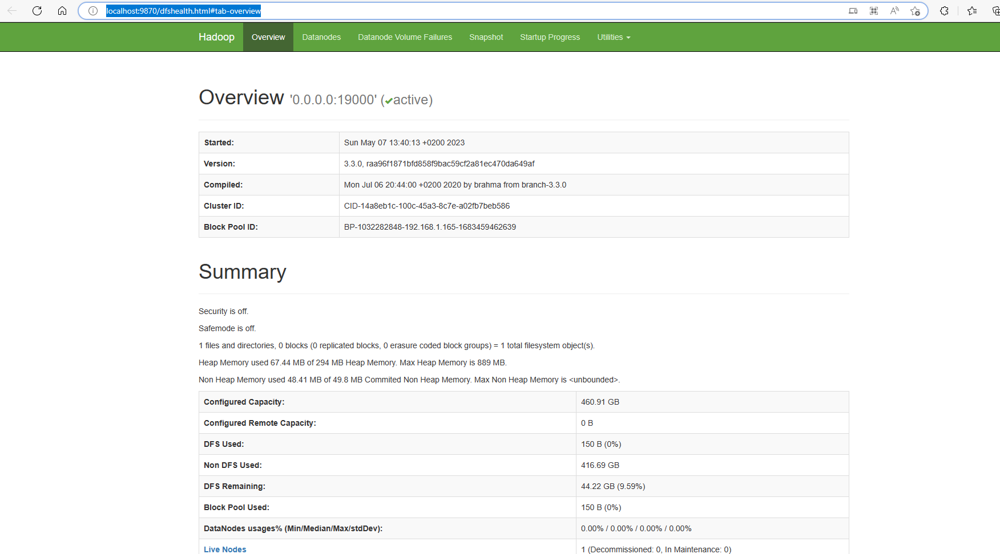
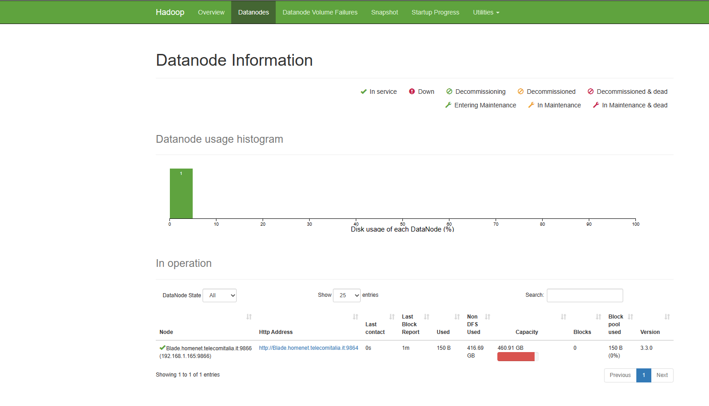

# How to install Hadoop on Windows 11


Hello everyone, today we are going to to install Hadoop 3.3.0 on Windows 11.

## Prerequisites

1. Java 8 runtime environment (JRE) 
2. Apache Hadoop 3.3.0


### Step 1 - Download Hadoop binary package

The first step is to download Hadoop binaries from the official website. 
The binary package size is about 478M MB.

https://archive.apache.org/dist/hadoop/common/hadoop-3.3.0/hadoop-3.3.0.tar.gz


## Step 2 - Unpack the package


After finishing the file download, we should unpack the package using 7zip or command line.

```
cd Downloads 
```

Because I am installing Hadoop in folder Haddop  of my C drive (C:\Hadoop) 

we create the the directory

```
mkdir C:\Hadoop
```

then run the following command to unzip:

```
tar -xvzf  hadoop-3.3.0.tar.gz -C C:\Hadoop\
```

The command will take quite a few minutes as there are numerous files included and the latest version introduced many new features.

After the unzip command is completed we have to install the Java.


## Step 2 -Java  installation

Java is required to run Hadoop. If you have not installed Java , please install it.

You can install Java 8 from the following page:

https://www.oracle.com/it/java/technologies/javase/javase8-archive-downloads.html#license-lightbox

I am choosing the Java **SE Runtime Environment 8u202** and I choose the Windows X64 version **jre-8u202-windows-x64.tar**

After finishing the file download we open a new command prompt, we should unpack the package

```
cd Downloads 
```

Because I am installing Java in folder Java of my C drive (C:\Java) 

we create the the directory

```
mkdir C:\Java
```

the Java version that


then run the following command to unzip:

```
tar -xvzf  jre-8u202-windows-x64.tar.gz -C C:\Java\
```


## Step 3 - Install Hadoop native IO binary
Hadoop on Linux includes optional Native IO support. However Native IO is mandatory on Windows and without it you will not be able to get your installation working. The Windows native IO libraries are not included as part of Apache Hadoop release. Thus we need to build and install it.

infoThe following repository already pre-built Hadoop Windows native libraries:

https://github.com/ruslanmv/How-to-install-Hadoop-on-Windows/tree/master/winutils/hadoop-3.3.0-YARN-8246/bin

warning These libraries are not signed and there is no guarantee that it is 100% safe. We use it purely for test&learn purpose.


Download all the files in the following location and save them to the bin folder under Hadoop folder. 

You can use Git by typing in your terminal

```
git clone https://github.com/ruslanmv/How-to-install-Hadoop-on-Windows.git
```

and then copy

```
cd How-to-install-Hadoop-on-Windows\winutils\hadoop-3.3.0-YARN-8246\bin
copy *.*  C:\Hadoop\hadoop-3.3.0\bin
```


## Step 5 - Configure environment variables

Now we've downloaded and unpacked all the artefacts we need to configure two important environment variables.

First you click the windows button and type environment




### Configure  Environment variables

We configure **JAVA_HOME** environment variable

by adding new  environment variable


Variable name : `JAVA_HOME`
Variable value:  `C:\Java\jre1.8.0_202`




the same with  **HADOOP_HOME** environment variable


Variable name : `HADOOP_HOME`
Variable value:  `C:\Hadoop\hadoop-3.3.0`





### b) Configure PATH environment variable

Once we finish setting up the above two environment variables, we need to add the bin folders to the PATH environment variable. We click on Edit



If PATH environment exists in your system, you can also manually add the following two paths to it:

```
%JAVA_HOME%/bin
%HADOOP_HOME%/bin
```





### Verification of Installation

Once you complete the installation, Close your terminal window and open a new one and please run the following command  to verify:

```
java -version
```

you will have 

```
java version "1.8.0_291"
Java(TM) SE Runtime Environment (build 1.8.0_291-b10)
Java HotSpot(TM) Client VM (build 25.291-b10, mixed mode, sharing)
```

You should also be able to run the following command:

```
hadoop -version
```

```
java version "1.8.0_202"
Java(TM) SE Runtime Environment (build 1.8.0_202-b08)
Java HotSpot(TM) 64-Bit Server VM (build 25.202-b08, mixed mode)

```

and finally directly to verify that our above steps are completed successfully:

```
winutils.exe 
```





## Step 6 - Configure Hadoop

Now we are ready to configure the most important part - Hadoop configurations which involves Core, YARN, MapReduce, HDFS configurations. 

### Configure core site

Edit file **core-site.xml** in %HADOOP_HOME%\etc\hadoop folder. 

For my environment, the actual path is C:\Hadoop\hadoop-3.3.0\etc\hadoop

Replace configuration element with the following:

```
<configuration>
   <property>
     <name>fs.default.name</name>
     <value>hdfs://0.0.0.0:19000</value>
   </property>
</configuration>
```


### Configure HDFS

Edit file **hdfs-site.xml** in %HADOOP_HOME%\etc\hadoop folder. 

Before editing, please correct two folders in your system: one for namenode directory and another for data directory.  For my system, I created the following two sub folders:

```
mkdir C:\hadoop\hadoop-3.3.0\data\datanode
```

```
mkdir C:\hadoop\hadoop-3.3.0\data\namenode
```


Replace configuration element with the following (remember to replace the highlighted paths accordingly):

```
<configuration>
   <property>
     <name>dfs.replication</name>
     <value>1</value>
   </property>
   <property>
     <name>dfs.namenode.name.dir</name>
     <value>/hadoop/hadoop-3.3.0/data/namenode</value>
   </property>
   <property>
     <name>dfs.datanode.data.dir</name>
     <value>/hadoop/hadoop-3.3.0/data/datanode</value>
   </property>
</configuration>
```


### Configure MapReduce and YARN site

Edit file **mapred-site.xml** in %HADOOP_HOME%\etc\hadoop folder. 

Replace configuration element with the following:

```
<configuration>
    <property>
        <name>mapreduce.framework.name</name>
        <value>yarn</value>
    </property>
    <property> 
        <name>mapreduce.application.classpath</name>
        <value>%HADOOP_HOME%/share/hadoop/mapreduce/*,%HADOOP_HOME%/share/hadoop/mapreduce/lib/*,%HADOOP_HOME%/share/hadoop/common/*,%HADOOP_HOME%/share/hadoop/common/lib/*,%HADOOP_HOME%/share/hadoop/yarn/*,%HADOOP_HOME%/share/hadoop/yarn/lib/*,%HADOOP_HOME%/share/hadoop/hdfs/*,%HADOOP_HOME%/share/hadoop/hdfs/lib/*</value>
    </property>
</configuration>
```

Edit file **yarn-site.xml** in %HADOOP_HOME%\etc\hadoop folder. 

```
<configuration>
    <property>
        <name>yarn.nodemanager.aux-services</name>
        <value>mapreduce_shuffle</value>
    </property>
    <property>
        <name>yarn.nodemanager.env-whitelist</name>
        <value>JAVA_HOME,HADOOP_COMMON_HOME,HADOOP_HDFS_HOME,HADOOP_CONF_DIR,CLASSPATH_PREPEND_DISTCACHE,HADOOP_YARN_HOME,HADOOP_MAPRED_HOME</value>
    </property>
</configuration>
```





### Step 7 - Initialise HDFS 

Run the following command in Command Prompt 

```
hdfs namenode -format
```

The following is an example when it is formatted successfully:


### Step 8 - Start HDFS daemons 

Run the following command to start HDFS daemons in Command Prompt:

```
%HADOOP_HOME%\sbin\start-dfs.cmd
```

Two Command Prompt windows will open: one for datanode and another for namenode as the following screenshot shows:



Verify HDFS web portal UI through this link: http://localhost:9870/dfshealth.html#tab-overview.


You can also navigate to a data node UI:





### Step 9 - Start YARN daemons

warning You may encounter permission issues if you start YARN daemons using normal user. To ensure you don't encounter any issues. Please open a Command Prompt window using Run as administrator.

Run the following command in an elevated Command Prompt window (Run as administrator) to start YARN daemons:

```
%HADOOP_HOME%\sbin\start-yarn.cmd
```

Similarly two Command Prompt windows will open: one for resource manager and another for node manager as the following screenshot shows:


You can verify YARN resource manager UI when all services are started successfully. 

http://localhost:8088

